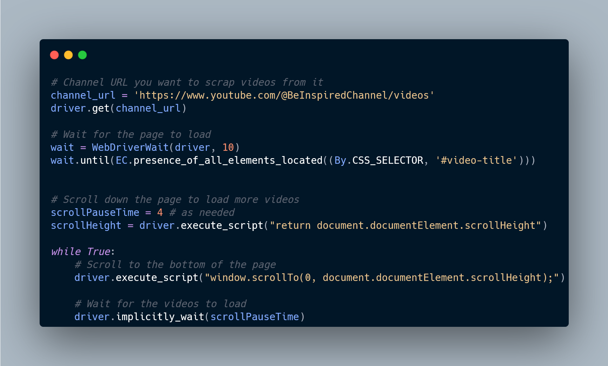

# Python Script

[](https://www.python.org/downloads/release/python-390/)

## Description
This is a simple and basic Python script to scrap data from webpages using Selenium.
The purpose behind this code is to get videos title by CSS element from a Youtube channel and the user will choose the one to be played.


## Installation
1. Make sure you have Python 3.0 installed. You can download it from [here](https://www.python.org/downloads/release/python-390/).
2. Clone this repository:

   ```shell
   git clone https://github.com/AlirezaRafiyian/Automation.git

I. Navigate to the project directory:
  cd your-repository
II. Install the required dependencies: pip install -r requirements.txt

  
